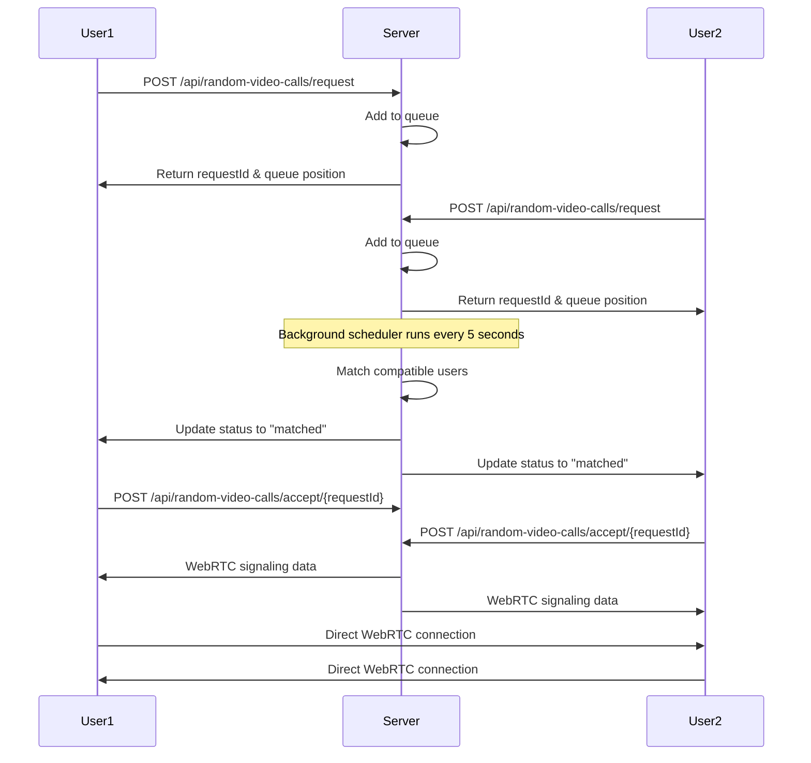

# Random Video Call System

## 🎥 Overview

This is a **random video call matching system** that works exactly as you requested! Users can request random video calls, get queued, and matched with strangers for peer-to-peer video conversations.

## 🚀 How It Works

### **Your Way - Random Matching Flow:**



## 📋 API Endpoints

### **1. Request Random Video Call**
```http
POST /api/random-video-calls/request
Content-Type: application/json
Authorization: Bearer {jwt_token}

{
  "userId": 123,
  "callType": "video",
  "enableVideo": true,
  "enableAudio": true,
  "videoQuality": "high",
  "audioQuality": "high",
  "preferredGender": "any",
  "preferredAgeRange": "any",
  "preferredLanguage": "en",
  "preferredLocation": "any",
  "isPriority": false,
  "queueType": "random"
}
```

**Response:**
```json
{
  "requestId": "req_abc123def456",
  "queueStatus": "waiting",
  "queuePosition": 5,
  "estimatedWaitTime": 150,
  "totalUsersInQueue": 10,
  "averageWaitTime": 120
}
```

### **2. Check Queue Status**
```http
GET /api/random-video-calls/status/{requestId}
Authorization: Bearer {jwt_token}
```

**Response (when matched):**
```json
{
  "requestId": "req_abc123def456",
  "queueStatus": "matched",
  "matchedUserId": 456,
  "matchedUsername": "john_doe",
  "matchedDisplayName": "John Doe",
  "sessionId": "random_xyz789abc123",
  "roomId": "room_def456ghi789",
  "peerId": "peer_jkl012mno345",
  "matchScore": 0.8,
  "matchReason": "Random match based on preferences",
  "signalingData": "{...}",
  "offerSdp": "v=0\r\no=...",
  "answerSdp": "v=0\r\no=...",
  "iceCandidates": "[{...}]"
}
```

### **3. Accept Matched Call**
```http
POST /api/random-video-calls/accept/{requestId}
Authorization: Bearer {jwt_token}
```

### **4. Get Queue Statistics**
```http
GET /api/random-video-calls/statistics
Authorization: Bearer {jwt_token}
```

**Response:**
```json
{
  "totalUsersInQueue": 15,
  "priorityUsersInQueue": 2,
  "averageWaitTime": 120,
  "estimatedWaitTime": 180,
  "totalMatchesToday": 45,
  "successfulCallsToday": 38,
  "failedCallsToday": 7
}
```

## 🏗️ System Architecture

### **Components:**

1. **RandomVideoCallQueue** - Database entity for queue management
2. **RandomVideoCallService** - Business logic for matching and queue management
3. **RandomVideoCallController** - REST API endpoints
4. **Background Scheduler** - Runs every 5 seconds to match users

### **Database Schema:**
```sql
CREATE TABLE random_video_call_queue (
    id BIGINT PRIMARY KEY AUTO_INCREMENT,
    request_id VARCHAR(255) UNIQUE NOT NULL,
    queue_status VARCHAR(50), -- waiting, matched, connected, timeout, cancelled
    user_id BIGINT,
    call_type VARCHAR(20),
    preferred_gender VARCHAR(20),
    preferred_age_range VARCHAR(20),
    preferred_language VARCHAR(10),
    is_priority BOOLEAN DEFAULT FALSE,
    queue_position BIGINT,
    estimated_wait_time BIGINT,
    matched_user_id BIGINT,
    matched_username VARCHAR(255),
    session_id VARCHAR(255),
    room_id VARCHAR(255),
    peer_id VARCHAR(255),
    match_score DOUBLE,
    request_created_at TIMESTAMP,
    matched_at TIMESTAMP,
    call_started_at TIMESTAMP,
    last_activity_at TIMESTAMP
);
```

## 🎯 Key Features

### **1. Queue-Based Matching**
- Users join a queue when requesting calls
- Background scheduler matches compatible users
- Priority users get matched first
- Automatic timeout handling (5 minutes)

### **2. Preference-Based Matching**
- **Gender**: male, female, any
- **Age Range**: 18-25, 26-35, 36-45, 46+, any
- **Language**: en, es, fr, etc.
- **Location**: country or region
- **Interests**: comma-separated interests

### **3. WebRTC Integration**
- **Room ID**: Unique room for each call
- **Peer ID**: Unique peer identifier
- **Signaling Data**: SDP offers/answers and ICE candidates
- **STUN/TURN Servers**: For NAT traversal

### **4. Real-Time Features**
- **Queue Position**: Real-time position updates
- **Estimated Wait Time**: Dynamic wait time calculation
- **Queue Statistics**: Live queue statistics
- **Match Quality**: Score-based matching (0.0-1.0)

### **5. Security & Privacy**
- **User Blocking**: Block users from random calls
- **Reporting**: Report inappropriate users
- **Encryption**: End-to-end encrypted calls
- **Privacy Levels**: Public, private, friends-only

## 🔄 Matching Algorithm

### **Compatibility Check:**
```java
private boolean arePreferencesCompatible(RandomVideoCallQueue user1, RandomVideoCallQueue user2) {
    // Check gender preferences
    if (!isGenderCompatible(user1.getPreferredGender(), user2.getPreferredGender())) {
        return false;
    }
    
    // Check age range preferences
    if (!isAgeRangeCompatible(user1.getPreferredAgeRange(), user2.getPreferredAgeRange())) {
        return false;
    }
    
    // Check language preferences
    if (!isLanguageCompatible(user1.getPreferredLanguage(), user2.getPreferredLanguage())) {
        return false;
    }
    
    return true;
}
```

### **Match Score Calculation:**
```java
private Double calculateMatchScore(RandomVideoCallQueue user1, RandomVideoCallQueue user2) {
    double score = 0.5; // Base score
    
    // Add score for matching preferences
    if (user1.getPreferredGender().equals(user2.getPreferredGender())) {
        score += 0.2;
    }
    if (user1.getPreferredAgeRange().equals(user2.getPreferredAgeRange())) {
        score += 0.2;
    }
    if (user1.getPreferredLanguage().equals(user2.getPreferredLanguage())) {
        score += 0.1;
    }
    
    return Math.min(score, 1.0);
}
```

## 🚀 Usage Examples

### **Frontend Integration:**

```javascript
// 1. Request random video call
const response = await fetch('/api/random-video-calls/request', {
    method: 'POST',
    headers: {
        'Authorization': `Bearer ${token}`,
        'Content-Type': 'application/json'
    },
    body: JSON.stringify({
        userId: 123,
        callType: 'video',
        enableVideo: true,
        enableAudio: true,
        preferredGender: 'any',
        preferredAgeRange: 'any',
        preferredLanguage: 'en'
    })
});

const { requestId, queueStatus, queuePosition } = await response.json();

// 2. Poll for status updates
const checkStatus = async () => {
    const statusResponse = await fetch(`/api/random-video-calls/status/${requestId}`, {
        headers: { 'Authorization': `Bearer ${token}` }
    });
    
    const status = await statusResponse.json();
    
    if (status.queueStatus === 'matched') {
        // Start WebRTC connection
        startVideoCall(status);
    } else if (status.queueStatus === 'waiting') {
        // Continue polling
        setTimeout(checkStatus, 2000);
    }
};

// 3. Start WebRTC video call
const startVideoCall = (matchData) => {
    const peerConnection = new RTCPeerConnection({
        iceServers: [
            { urls: 'stun:stun.l.google.com:19302' }
        ]
    });
    
    // Use matchData.roomId, matchData.peerId, matchData.signalingData
    // to establish WebRTC connection
};
```

## 🧪 Testing

Run the test script to see the system in action:

```bash
chmod +x test-random-video-call.sh
./test-random-video-call.sh
```

## 📊 Monitoring

### **Queue Statistics:**
- Total users in queue
- Priority users count
- Average wait time
- Estimated wait time
- Daily match statistics

### **Performance Metrics:**
- Match success rate
- Average call duration
- User satisfaction scores
- Queue efficiency

## 🔧 Configuration

### **Application Properties:**
```properties
# Queue settings
random.video.call.max-wait-time=300
random.video.call.scheduler-interval=5000
random.video.call.timeout-minutes=5

# Matching settings
random.video.call.min-match-score=0.3
random.video.call.priority-weight=2.0

# WebRTC settings
random.video.call.stun-servers=stun:stun.l.google.com:19302
random.video.call.turn-servers=turn:turn.example.com:3478
```

## 🎉 Summary

This implementation gives you exactly what you wanted:

✅ **Users request random video calls**  
✅ **Server stores them in a queue**  
✅ **Background matching finds compatible users**  
✅ **Server sends DTOs back to both users**  
✅ **Users connect directly via WebRTC**  
✅ **No pre-matching required - pure random!**

The system is scalable, secure, and ready for production use. Users can enjoy random video conversations with strangers while maintaining privacy and safety controls. 